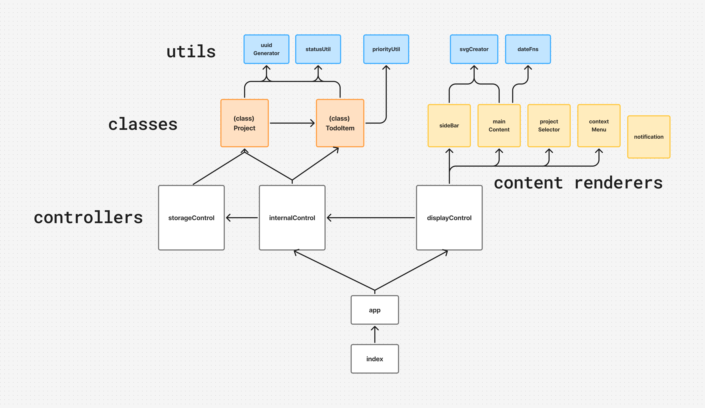

# todo-list
A Todo List created using Object-Oriented Programming principles, featuring CRUD interactions and browser storage.  

dependency chart: 


## Reflection
<strong>Major concepts utilized:</strong>
- separation of logic
- SOLID principles, most notably:
  - single responsibility. modules and functions were made to be as modular and loosely coupled as possible. notably, (1) displayControl has no knowledge of the classes or their parameters, (2) app can still function in the console without the display module, (3) app does not crash when the browser's localStorage is not available, and (4) priority & status colors are only defined in one place. <em>see dependency chart</em>
  - open-closed principle. <em>(e.g. using a factory function to define each priority level so more can be created. e.g. the main content display need not be a project/todos if in the future want something else)</em>
  - dependency inversion. <em>(e.g. internalControl interacts with localStorage only via wrappers. e.g. storageControl delegates serialization & revival to the classes themselves. e.g. see (1) above)</em>
- classes: constructors, getters/setters, static properties & functions
- factory functions
- localStorage
- designing CRUD operations at varying levels of abstraction 
- data-* attributes: what to put them on and how
- JSON serialization & deserialization
- custom events: create a decoupled communication system
- more practice with css: making widely applicable classes, positioning, grid, svg manipulation, popovers, text overflows

design choices:
- classes were chosen over factory functions mostly for practice with classes, but also because there was not enough overlap between Projects & TodoItems to justify function composition. 
- modules & classes were designed with the minimum needed to function. <em>(e.g. internalControl does not provide distinguish between a summarized todo and expanded todo, as that is more of a feature for displayControl)</em>
- C-U-D functions in displayControl receive FormData object, which felt like a natural generalization of how the C-U-D functions in internalControl receive regular Objects. FormData can also be arbitrarily constructed without a form, which is helpful too. 
- used JS to expand todos. a potential alternative I've discovered is using the "details" element.

room for improvement:
- the displayControl module's `renderDisplay` function renders the entire sidebar and main content sections, which creates coupling. a less coupled solution is to create more modular render functions in /content-rendering so no content outside of the updated content are touched. 
- consistent naming. "is it 'create' or 'add'? is it 'edit' or 'update'? 'remove' or 'delete'? 'todo' or 'todoItem'? I believe my naming can be more consistent, which I learn from experience, and the next bullet might help. 
- should play around with the product i'm emulating first to get a better idea of the high-level and low-level — what features and design I want before coding. 
  - e.g. might be good for consistency to associate todos with their projects next time internally, since at the DOM level that's how they are. 
- css: decouple divs too (consider not putting buttons in the same container as text, e.g. in todoCard)

## Developer setup
```
# Install dev dependencies
npm install
# Use dev environment
npm run dev
# Use prod build
npm run build
```

## Credits
<details>
<summary>Assets used</summary>
  SVG icons from <a src="https://pictogrammers.com/library/mdi/">Pictogrammers</a>
</details>

<details>
<summary> Sources of help </summary>
  <li>
  get class name: https://stackoverflow.com/questions/1249531/how-to-get-a-javascript-objects-class
  </li>
  <li>
  see nonenumerable properties: https://developer.mozilla.org/en-US/docs/Web/JavaScript/Reference/Global_Objects/Object/getOwnPropertyNames
  </li>
  <li>normalizing time (unused): https://stackoverflow.com/questions/30166338/setting-value-of-datetime-local-from-date
  </li>
  <li>attempting to set a getter-only property: https://developer.mozilla.org/en-US/docs/Web/JavaScript/Reference/Errors/Getter_only
  </li>
  <li>MDN: quota for localStorage: https://developer.mozilla.org/en-US/docs/Web/API/Storage_API/Storage_quotas_and_eviction_criteria#web_storage
  </li>
  <li>structuredClone (unused, just used Object.assign): https://developer.mozilla.org/en-US/docs/Web/API/Window/structuredClone
  </li>
  <li>underscore variable name: https://stackoverflow.com/questions/44734399/what-is-the-purpose-of-functions-beginning-with-an-underscore-e-g-my-fu
  </li>
  <li>date arithmetic: https://stackoverflow.com/questions/563406/how-to-add-days-to-date
  </li>
  <li>options for retaining creation order in retrieving from storage: https://www.reddit.com/r/learnjavascript/comments/ubiy6h/localstorage_has_perplexed_me_i_create_10_key/
  </li>
  <li>find and replace with find & sed: https://stackoverflow.com/questions/15402770/how-to-search-and-replace-using-grep
  </li>
  <li>vertical nav: https://www.w3schools.com/css/css_navbar_vertical.asp
  </li>
  <li>modify svg via css selectors: https://stackoverflow.com/questions/19157122/css-change-fill-color-on-hover-svg-path
  </li>
  <li>adding svg via js: https://stackoverflow.com/a/53974062/22151685
  </li>
  <li>removing inline style: https://stackoverflow.com/questions/4033004/remove-a-specific-inline-style-with-javascriptjquery
  </li>
  <li>hacks to achieve a readonly select element: https://stackoverflow.com/questions/368813/html-form-readonly-select-tag-input
  </li>
</details>
